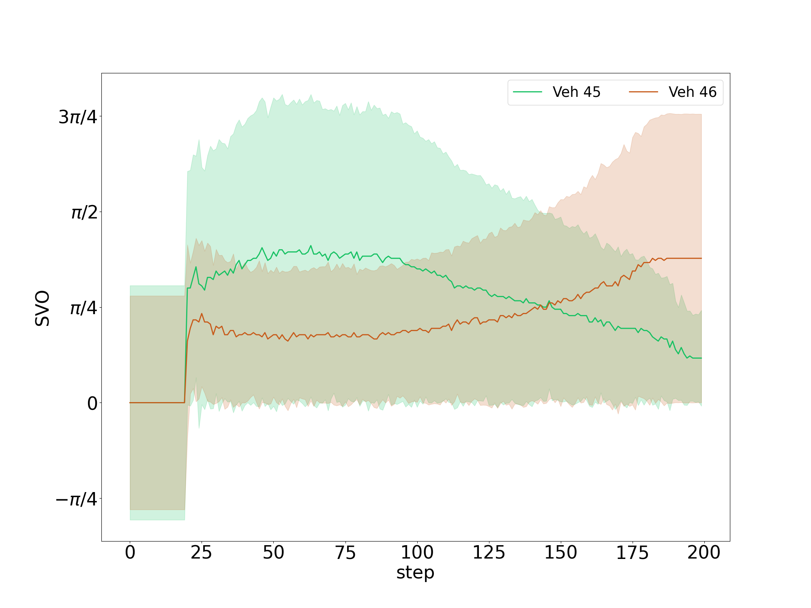

# SVO4AD (NGSIM demo)
This repo is the implementation of the paper "[Social behavior for autonomous vehicles](https://www.pnas.org/doi/10.1073/pnas.1820676116)". It contains NGSIM env that can replay vehicle trajectories in the NGSIM dataset while also simulate some interactive behaviors, as well as Maximum Entropy-based SVO prediction in this paper.


## Getting started
Install the dependent package
```shell
pip install -r requirements.txt
```

Download the NGSIM dataset from [this website](https://data.transportation.gov/Automobiles/Next-Generation-Simulation-NGSIM-Vehicle-Trajector/8ect-6jqj) (export to csv file) and ngsim_data_process.py along with the path to the downloaded csv file (may take a while)
```shell
python ngsim_data_process.py --path [YOUR PATH]/Next_Generation_Simulation__NGSIM__Vehicle_Trajectories_and_Supporting_Data.csv --scene i-80
```

Choose some vehicle and predict their svo:
```shell
python main_ngsim_ma_predict_given_traj.py 
```
Some settings

- start_time：认为交互开始的那一步，一般轨迹都有1000~2000步
- duration：认为交互持续的时间
- save_dir
- scene：需要和data process的结果一致，如果使用us-101，则要重新data process
- veh_id：必须设置想观察的车的id，地图上只会有这些车。第一个元素即为ego car，用来以它为准对齐各个车的step。在目前给定轨迹的demo中区分ego的意义暂时不大。

- rollout step：对应论文中预测SVO用的一段sequence的长度

## Results
Examplar results are given in "docs/", by plotting the sampled NGSIM trajectories and SVO predictions like:



## Reference
```latex
@article{DBLP:journals/pnas/SchwartingPAKR19,
  author    = {Wilko Schwarting and
               Alyssa Pierson and
               Javier Alonso{-}Mora and
               Sertac Karaman and
               Daniela Rus},
  title     = {Social behavior for autonomous vehicles},
  journal   = {Proc. Natl. Acad. Sci. {USA}},
  volume    = {116},
  number    = {50},
  pages     = {24972--24978},
  year      = {2019},
}
```

## License
This repo is released under the MIT License. The NGSIM data processing code is borrowed from [NGSIM interface](https://github.com/Lemma1/NGSIM-interface). The NGSIM env is built on top of [highway env](https://github.com/eleurent/highway-env) which is released under the MIT license.
